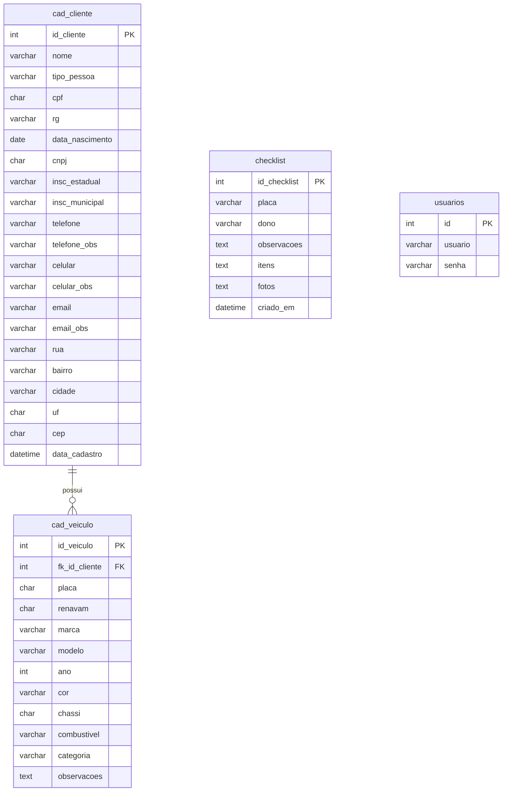

# Projeto Integrado 2º semestre - Desenvolvimento de Software Multiplataforma - FATEC Franca
Disciplinas de Desenvolvimento Web, Banco de Dados Relacional e Engenharia de Software

## ATENÇÃO:

Para ver como está o site, basta: <br>
```
1- baixar o Node.js 
2- baixar o conteudo do repositorio 
3- abrir o prompt de comando na pasta do repositorio 
4- instalar dependencias do node(npm install)
5- usar o comando "npm server.js" 
6- entrar no link: "localhost:3000" 
```

## Objetivo do projeto 
Desenvolver um sistema (front-end, back-end e banco de dados) que tenha no minimo 3 funcionalidades. 
<br> <br>
<b>Tema: Checklist para AutoCenter </b> <br><br>
<b>Objetivo: </b>Garantir transparencia para o cliente ao chegar na oficina e fazer um levantamento de todas as avarias e objetos deixados no veiculo.
<br>

## Nossa ideia
Criar uma aplicação onde podemos manter clientes no nosso sistema, como também o carro dos mesmo. Por fim sera impresso um checklist do carro com todas as informaçoes do carro no presente momento. 
<br>

## Tecnologias utilizadas
<b>FRONT-END:</b> <br>
- HTML5<br>
- CSS3<br>
- JavaScript<br>

<b>BACK-END:</b><br>
- NODE.js<br>

<b>BANCO DE DADOS:</b> <br>
- MYSQL<br>

## Integrantes do Projeto
- Guilherme Porto -Scrum Master| [GitHub](https://github.com/fnxis)
- Leonardo Bonamin - Product Owner | [GitHub](https://github.com/LeonardoBonamin)


  # Diagrama Entidade-Relacionamento (DER) - RevisAuto

## DER em formato Mermaid



## Descrição das Entidades e Relacionamentos

### 1. **cad_cliente** (Cliente)
- **Descrição**: Armazena informações de clientes (Pessoa Física ou Pessoa Jurídica)
- **Chave Primária**: `id_cliente`
- **Atributos Especiais**:
  - `tipo_pessoa`: Define se é 'PF' (Pessoa Física) ou 'PJ' (Pessoa Jurídica)
  - Campos condicionais: CPF/RG para PF, CNPJ/Inscrições para PJ
  - Múltiplos contatos: telefone, celular, email (cada um com observações)
  - Endereço completo

### 2. **cad_veiculo** (Veículo)
- **Descrição**: Armazena informações dos veículos dos clientes
- **Chave Primária**: `id_veiculo`
- **Chave Estrangeira**: `fk_id_cliente` → `cad_cliente.id_cliente`
- **Relacionamento**: 
  - Um cliente pode ter **muitos** veículos (1:N)
  - Um veículo pertence a **um** cliente

### 3. **checklist** (Checklist)
- **Descrição**: Armazena checklists de revisão/inspeção
- **Chave Primária**: `id_checklist`
- **Observação**: Esta tabela não possui chave estrangeira explícita, mas os campos `placa` e `dono` sugerem relação com `cad_veiculo` e `cad_cliente`
- **Recomendação**: Adicionar `fk_id_veiculo` para estabelecer relacionamento formal

### 4. **usuarios** (Usuários)
- **Descrição**: Armazena credenciais de acesso ao sistema
- **Chave Primária**: `id`
- **Relacionamento**: Tabela isolada, sem relacionamentos com outras entidades

## Relacionamentos

1. **cad_cliente ↔ cad_veiculo**: 
   - Tipo: **1:N** (Um para Muitos)
   - Um cliente pode possuir vários veículos
   - Um veículo pertence a apenas um cliente

2. **checklist** (relacionamento implícito):
   - Deveria relacionar-se com `cad_veiculo` através de `fk_id_veiculo`
   - Um veículo pode ter vários checklists
   - Um checklist pertence a um veículo

## Observações e Recomendações

1. **Tabela checklist**: Considere adicionar `fk_id_veiculo INT` como chave estrangeira para `cad_veiculo.id_veiculo` para estabelecer relacionamento formal.

2. **Normalização**: A tabela `cad_cliente` poderia ser normalizada separando dados de contato e endereço em tabelas auxiliares, mas a estrutura atual é funcional.

3. **Índices**: Considere adicionar índices em campos frequentemente consultados como `placa`, `cpf`, `cnpj`, `email`.


